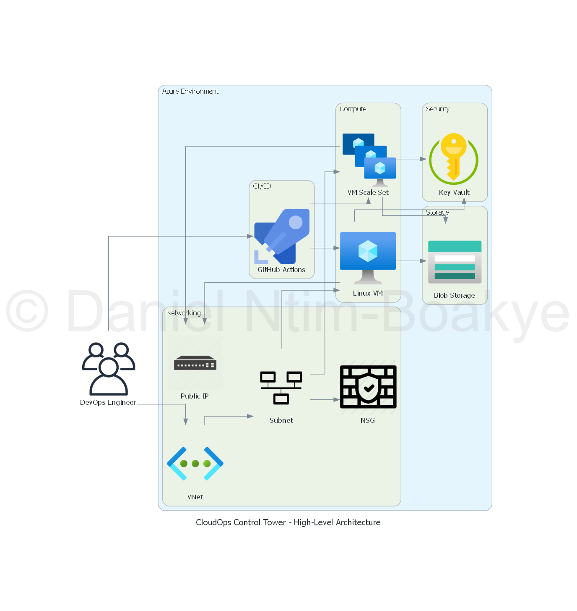

# CloudOps Control Tower

## Overview
The CloudOps Control Tower is a comprehensive infrastructure management solution designed to streamline the deployment and management of cloud resources across multiple environments. This project utilizes Terraform to define and provision resources in a structured and modular manner.

## Architecture Overview

Below is a high-level architecture diagram of the CloudOps Control Tower:

For detailed diagrams, see each module's README:
- [Networking Module](modules/networking/README.md)
- [Compute Module](modules/compute/README.md)
- [Storage Module](modules/storage/README.md)
- [Security Module](modules/security/README.md)

## Project Structure
The project is organized into several modules and environments, each serving a specific purpose:

- **modules/**: Contains reusable Terraform modules for different aspects of the infrastructure.
  - **security/**: Manages security resources such as Azure Key Vault and access policies.
  - **networking/**: Defines networking resources including virtual networks and network security groups.
  - **compute/**: Handles compute resources like virtual machines and scale sets.
  - **storage/**: Manages storage resources such as storage accounts and blob services.

- **environments/**: Contains environment-specific configurations for development, staging, and production.
  - **dev/**: Infrastructure configuration for the development environment.
  - **staging/**: Infrastructure configuration for the staging environment.
  - **prod/**: Infrastructure configuration for the production environment.

- **scripts/**: Contains utility scripts for managing the Terraform workflow.

## Scripts
- **`init.sh`**: Initializes the Terraform working directory.
- **`plan.sh`**: Generates an execution plan for the infrastructure changes.
- **`apply.sh`**: Applies the changes to reach the desired state.
- **`destroy.sh`**: Destroys the infrastructure managed by Terraform.

## Prerequisites
- Install [Terraform](https://www.terraform.io/downloads.html).
- Install [Azure CLI](https://learn.microsoft.com/en-us/cli/azure/install-azure-cli).
- Authenticate with Azure using `az login`.
- Ensure you have sufficient permissions to create resources in the target subscription.

## Usage
To get started with the CloudOps Control Tower, follow these steps:

1. **Clone the Repository**: Clone this repository to your local machine.
2. **Navigate to the Directory**: Change into the project directory.
3. **Initialize Terraform**: Run the `scripts/init.sh` script to initialize the Terraform working directory.
4. **Plan the Deployment**: Use the `scripts/plan.sh` script to create an execution plan.
5. **Apply the Changes**: Execute the `scripts/apply.sh` script to provision the resources.
6. **Destroy the Infrastructure**: When needed, run the `scripts/destroy.sh` script to tear down the infrastructure.

## Configuration
The project uses a combination of `.tfvars` files and module variables to customize the infrastructure. Modify the `terraform.tfvars` file to set your variable values according to your environment and requirements.

### Key Variables
- `environment`: Specifies the deployment environment (e.g., `dev`, `staging`, `prod`).
- `location`: The Azure region where resources will be deployed (e.g., `East US`).
- `resource_group_name`: The name of the resource group for the deployment.
- `vnet_name`: The name of the virtual network.
- `storage_account_name`: The name of the storage account (must be unique and follow Azure naming conventions).

### Example `terraform.tfvars` for Development
environment           = "dev"
location              = "East US"
resource_group_name   = "example-rg-dev"
vnet_name             = "vnet-dev"
storage_account_name  = "storacc-dev"

## Contributing
Contributions to the CloudOps Control Tower project are welcome. Please submit a pull request or open an issue for any enhancements or bug fixes.

## License
This project is licensed under the MIT License. See the LICENSE file for more details.cloudops_control_tower_-_compute_architecture