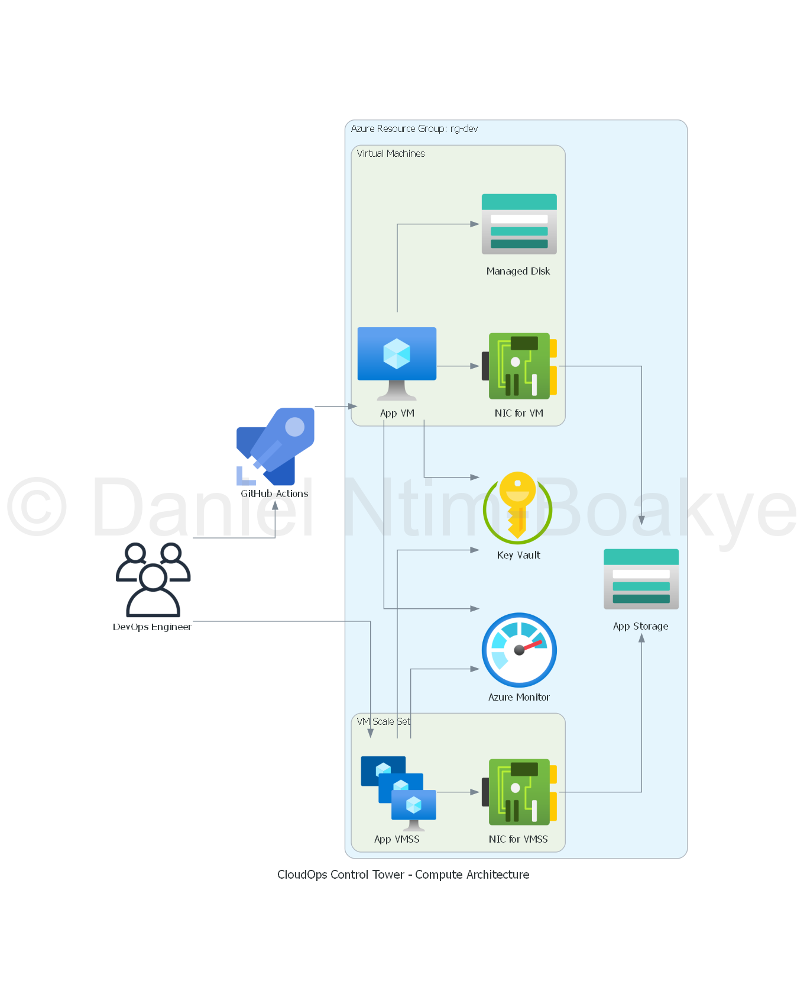

# Compute Module Documentation

## Overview

The Compute module is responsible for defining and managing compute resources within the CloudOps Control Tower platform. This includes the provisioning of virtual machines, scale sets, and any associated configurations necessary for running applications and services.

## Compute Architecture Diagram

Below is a diagram illustrating the compute architecture managed by this module:



## Purpose

The primary purpose of the Compute module is to provide a scalable and flexible infrastructure for hosting applications. It allows users to define the specifications of virtual machines, including size, image references, and instance counts, ensuring that the compute resources meet the demands of the applications being deployed.

## Usage

To use the Compute module, include it in your Terraform configuration by referencing it in your environment's main Terraform file. You will need to provide the necessary input variables to customize the compute resources according to your requirements.

### Example

```hcl
module "compute" {
  source              = "../modules/compute"
  vm_size             = var.vm_size
  image_reference     = var.image_reference
  instance_count      = var.instance_count
  ...
}
```

---

**Tip:**  
- The image path `../../diagrams/output/compute_diagram.png` assumes your module README is at [README.md](http://_vscodecontentref_/1) and the diagram is at `diagrams/output/compute_diagram.png` in your project root.  
- Adjust the path if your folder structure is different.

Let me know if you want a similar section for other modules!

## Configuration

The Compute module requires several input variables to be defined in the `variables.tf` file. These variables include:

- `vm_size`: The size of the virtual machines to be provisioned.
- `image_reference`: The reference to the image to be used for the virtual machines.
- `instance_count`: The number of instances to be created.

Make sure to review the `variables.tf` file for a complete list of configurable options.

## Outputs

The Compute module will provide outputs that can be used in other modules or environments. These outputs may include:

- `vm_ids`: The IDs of the provisioned virtual machines.
- `public_ip_addresses`: The public IP addresses assigned to the virtual machines.

Refer to the `outputs.tf` file for a detailed list of outputs available from this module.

## Conclusion

The Compute module is a vital component of the CloudOps Control Tower, enabling users to efficiently manage compute resources. By leveraging this module, you can ensure that your applications have the necessary infrastructure to operate effectively and scale as needed.