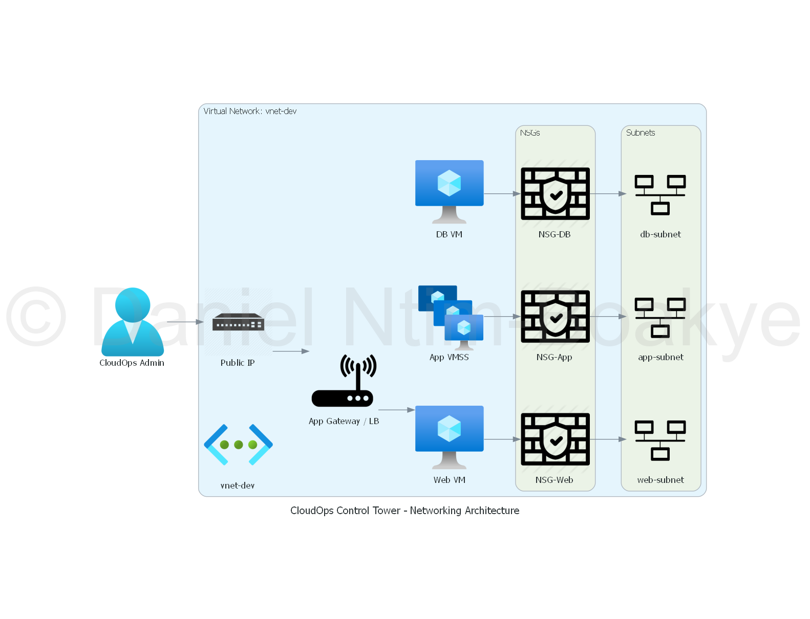

# CloudOps Control Tower - Networking Module

## Overview
The Networking module is responsible for defining and managing the networking resources required for the CloudOps Control Tower platform. This includes the creation of virtual networks, subnets, and network security groups to ensure secure and efficient communication between different components of the infrastructure.

## Networking Architecture Diagram

Below is a diagram illustrating the networking architecture managed by this module:



## Purpose
This module provides a reusable and configurable way to set up networking resources in Azure, allowing for consistent networking configurations across different environments (development, staging, production).

## Usage
To use the Networking module, include it in your environment's main Terraform configuration file. Specify the required input variables to customize the networking setup according to your needs.

### Example
```hcl
module "networking" {
  source              = "../modules/networking"
  environment         = var.environment
  location            = var.location
  resource_group_name = var.resource_group_name
  vnet_name           = var.vnet_name
  address_space       = var.address_space
  subnet_name         = var.subnet_name
  subnet_prefix       = var.subnet_prefix
}
```

## Configuration
The following input variables are required to configure the Networking module:

- `environment`: The environment for which the networking resources are being created (e.g., dev, staging, prod).
- `location`: The Azure region where the resources will be deployed.
- `resource_group_name`: The name of the resource group to contain the networking resources.
- `vnet_name`: The name of the virtual network to be created.
- `address_space`: The address space for the virtual network (CIDR notation).
- `subnet_name`: The name of the subnet to be created within the virtual network.
- `subnet_prefix`: The address prefix for the subnet (CIDR notation).

## Outputs
The Networking module will output the following information:

- `vnet_id`: The ID of the created virtual network.
- `subnet_id`: The ID of the created subnet.
- `nsg_id`: The ID of the created network security group.

## Notes
- Ensure that the specified address space and subnet prefix do not overlap with existing networks in your Azure environment.
- Review Azure networking best practices to optimize your network configuration for performance and security.