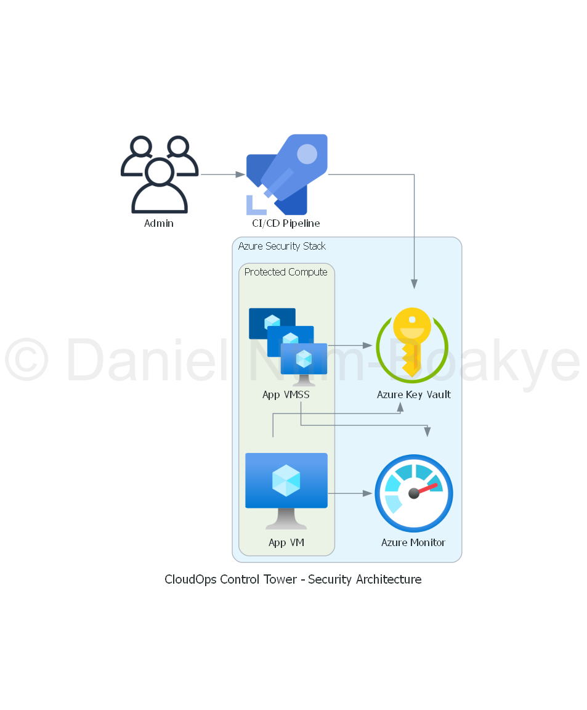

# Security Module README

## Overview

The Security module of the CloudOps Control Tower is designed to manage Azure Key Vault resources and their associated access policies. This module provides a secure way to store and manage sensitive information such as secrets, keys, and certificates.

## Security Architecture Diagram

Below is a diagram illustrating the security architecture managed by this module:



## Purpose

The primary purpose of this module is to create an Azure Key Vault and configure access policies that define which users or applications can access the secrets and keys stored within the vault. This ensures that sensitive data is protected and only accessible to authorized entities.

## Usage

To use the Security module, include it in your Terraform configuration as follows:

```hcl
module "security" {
  source              = "../modules/security"
  environment         = var.environment
  location            = var.location
  resource_group_name = var.resource_group_name
  tenant_id           = var.tenant_id
  object_id           = var.object_id
}
```

## Configuration

### Input Variables

- `environment`: The environment for which the Key Vault is being created (e.g., dev, staging, prod).
- `location`: The Azure region where the Key Vault will be deployed.
- `resource_group_name`: The name of the resource group in which the Key Vault will reside.
- `tenant_id`: The Azure Active Directory tenant ID.
- `object_id`: The object ID of the user or application that will have access to the Key Vault.

### Outputs

- `key_vault_id`: The ID of the created Azure Key Vault.
- Additional outputs can be defined as needed.

## Best Practices

- Ensure that the Key Vault is configured with soft delete and purge protection to prevent accidental deletion of secrets.
- Regularly review access policies to ensure that only necessary permissions are granted.
- Use managed identities for Azure resources to access the Key Vault securely without hardcoding credentials.

**Note:**  
- The image path `../../diagrams/output/security_diagram.png` assumes your diagram is saved as `security_diagram.png` in the `diagrams/output/` folder at the project root.
- Adjust the path if your folder structure is different.

Let me know if you need this for any other module!

## License

This module is open-source and available for use under the MIT License.