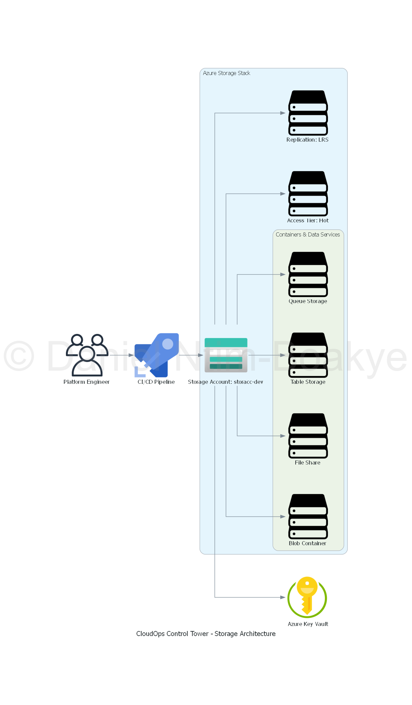

# Storage Module Documentation

## Overview
The Storage module is designed to manage Azure storage resources within the CloudOps Control Tower platform. This module allows you to create and configure storage accounts, containers, and blob services, ensuring that your application has the necessary storage capabilities.

## Storage Architecture Diagram

Below is a diagram illustrating the storage architecture managed by this module:



**Note:**  
- The image path `../../diagrams/output/storage_diagram.png` assumes your diagram is saved as `storage_diagram.png` in the `diagrams/output/` folder at the project root.
- Adjust the path if your folder structure is different.

## Purpose
The primary purpose of the Storage module is to provide a reusable and configurable way to provision Azure storage resources. This module can be utilized across different environments (development, staging, production) to maintain consistency and best practices in storage management.

## Usage
To use the Storage module, include it in your environment's main Terraform configuration file. You can specify the required input variables to customize the storage resources according to your needs.

### Example
```hcl
module "storage" {
  source              = "../modules/storage"
  environment         = var.environment
  location            = var.location
  resource_group_name = var.resource_group_name
  storage_account_name = var.storage_account_name
  replication_type    = var.replication_type
  access_tier         = var.access_tier
}
```

## Configuration
The following input variables are available for configuration:

- `environment`: The environment in which the storage resources will be created (e.g., dev, staging, prod).
- `location`: The Azure region where the storage resources will be provisioned.
- `resource_group_name`: The name of the resource group that will contain the storage resources.
- `storage_account_name`: The name of the storage account to be created.
- `replication_type`: The replication strategy for the storage account (e.g., LRS, GRS).
- `access_tier`: The access tier for the storage account (e.g., Hot, Cool, Archive).

## Outputs
The Storage module provides the following outputs:

- `storage_account_id`: The ID of the created storage account.
- `storage_account_primary_key`: The primary access key for the storage account.
- `storage_account_endpoint`: The endpoint URL for accessing the storage account.

## Best Practices
- Ensure that the storage account name is globally unique.
- Choose the appropriate replication type based on your availability and durability requirements.
- Regularly review and update access policies to maintain security.

## License
This module is licensed under the MIT License. See the LICENSE file for more details.